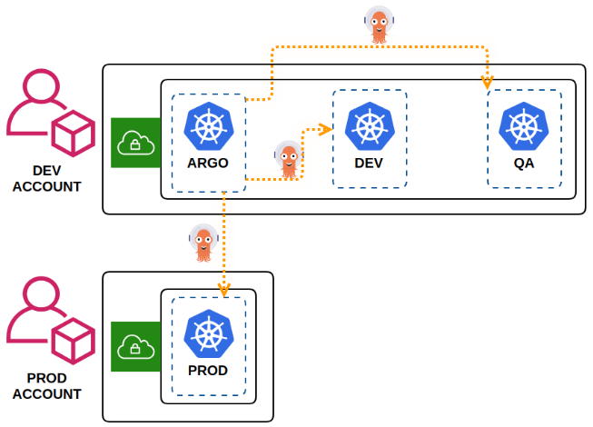

# Assumptions
- **ArgoCD** is used to deploy artifacts (apps, ingress controller and ingress resources, etc.) onto `dev`, `qa` and `prod` clusters,
- ArgoCD resources are deployed onto `argocd` cluster
- two AWS accounts to separate production env (not obligatory),
- docker images are built by any other tool / pipeline defined outside of this repo,
- k8s clusters are already created and `kubectl` access to all of them is ready,


# Requirements
- kubectl
- awscli v2
# Installation
## ArgoCD CLI
```
make install/cli
```
## ArgoCD k8s resources
To deploy all ArgoCD related resources, call:
```
kubectl config set-context argocd
make install/argocd
make update/apps
```
# Configuration
To get access to ArgoCD UI at http://localhost:8080, call:
```
kubectl --context argocd port-forward svc/argocd-server 8080:80
```
Initial password: 
```
kubectl --context argocd -n argocd get secret argocd-initial-admin-secret -o jsonpath="{.data.password}" | base64 -d; echo
```
Login CLI:
```
argocd login localhost:8080
```
Add more clusters:

*Notice*: we assume your `~/.kube/config` file contains `dev` and `prod` contexts already
```
argocd cluster add dev
argocd cluster add prod
```
The above commands install a ServiceAccount (argocd-manager), into the kube-system namespace of that kubectl context, and binds the service account to an admin-level ClusterRole. Argo CD uses this service account token to perform its management tasks (i.e. deploy/monitoring).
# Deployment
You're now good to go with the deployments.
All ArgoCD apps are defined as helm charts in [./apps/](./apps/) folder and are managed as ApplicationSet - see [applicationset.yaml](applicationset.yaml) for more details.

If you wish to add another deployable artifact, add a new folder with a helm chart inside.

To deploy make changes in main branch within [./apps/](./apps/) folder.
